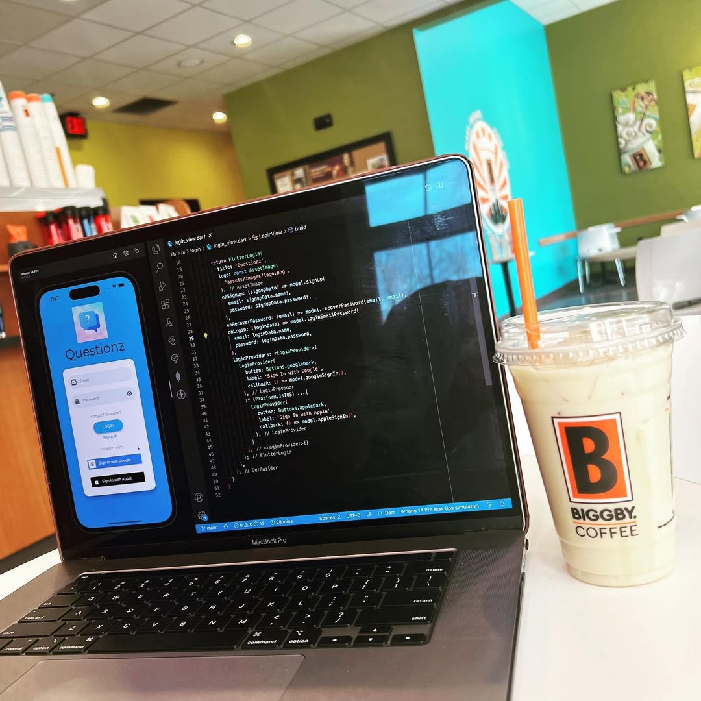
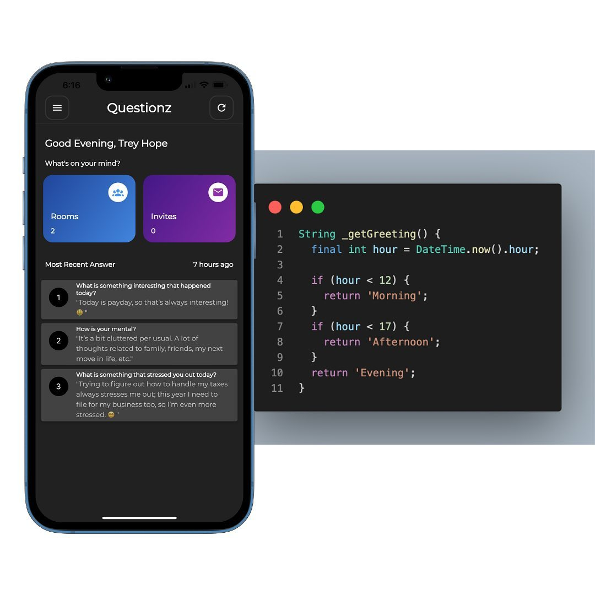
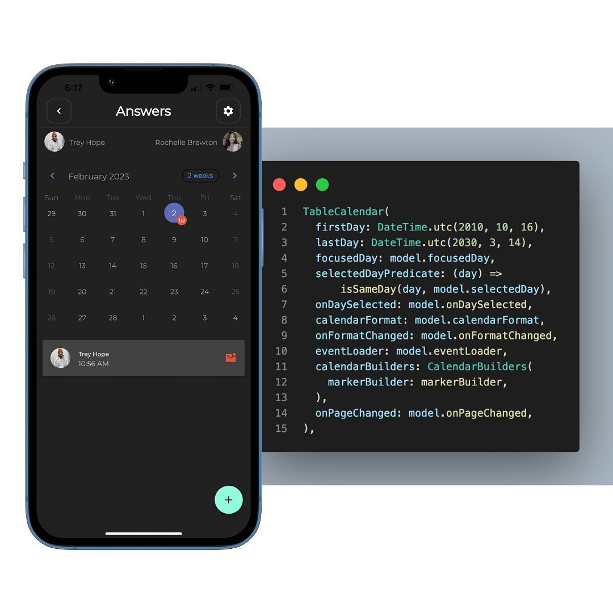
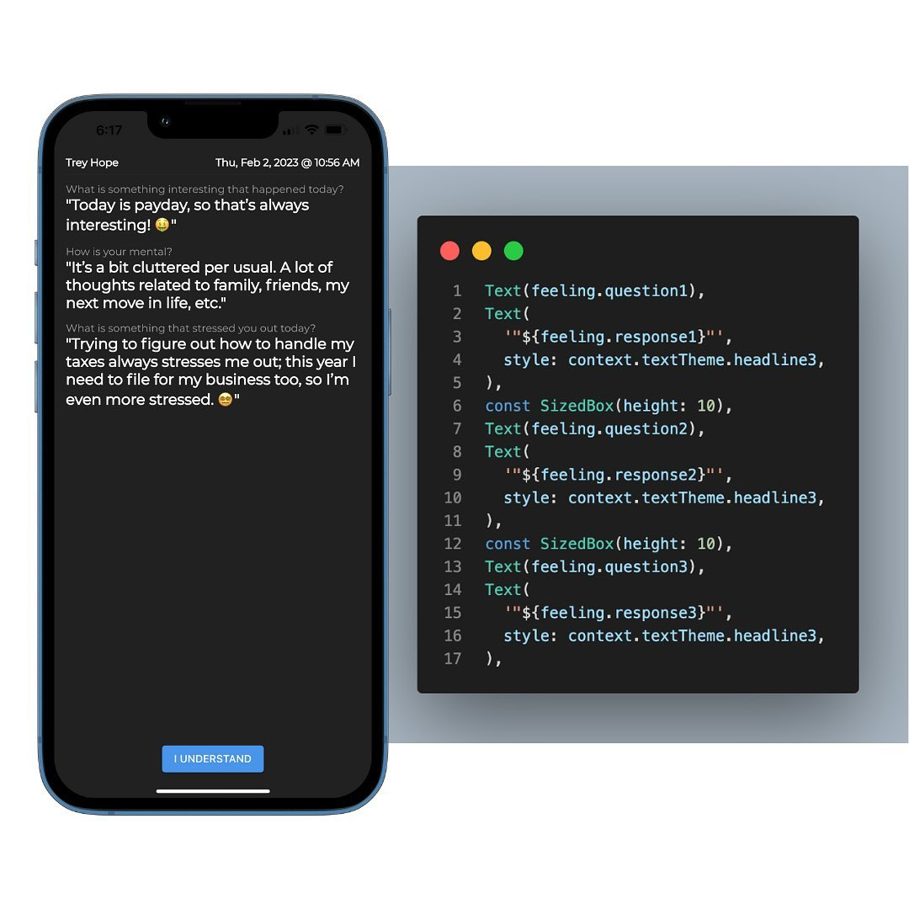
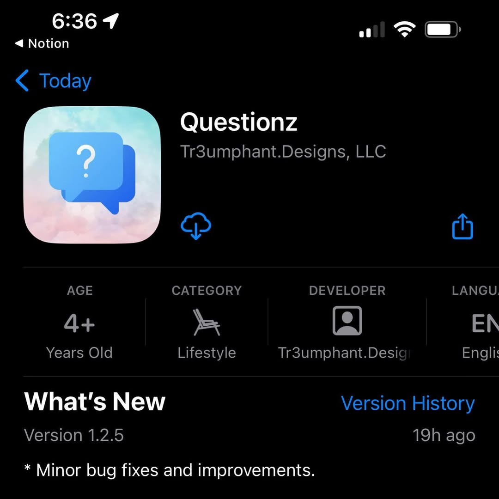

> Golden Chai Latte from [Biggby Coffee](https://biggby.com/) in Dayton, Ohio
> 

Been workin on a new app called Questionz.

Ask a friend, spouse, or family member, three questions of your choice daily.

They’ll be notified once you answer the questions.

You’ll also be notified once they read your answers.

I built the app in Flutter, and using MongoDB, GraphQL, Apollo Server, and Heroku for the backend.

Version 1.2.5 available for iOS and Android right now.

Any bugs, errors, or crashes, lemme know please 👌🏾