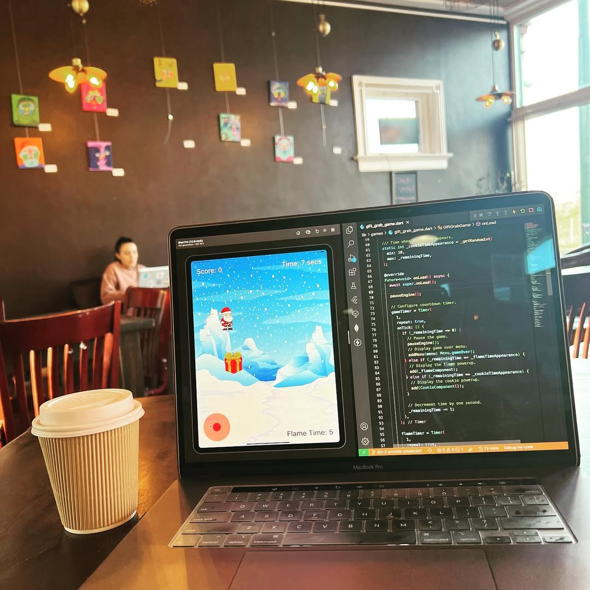
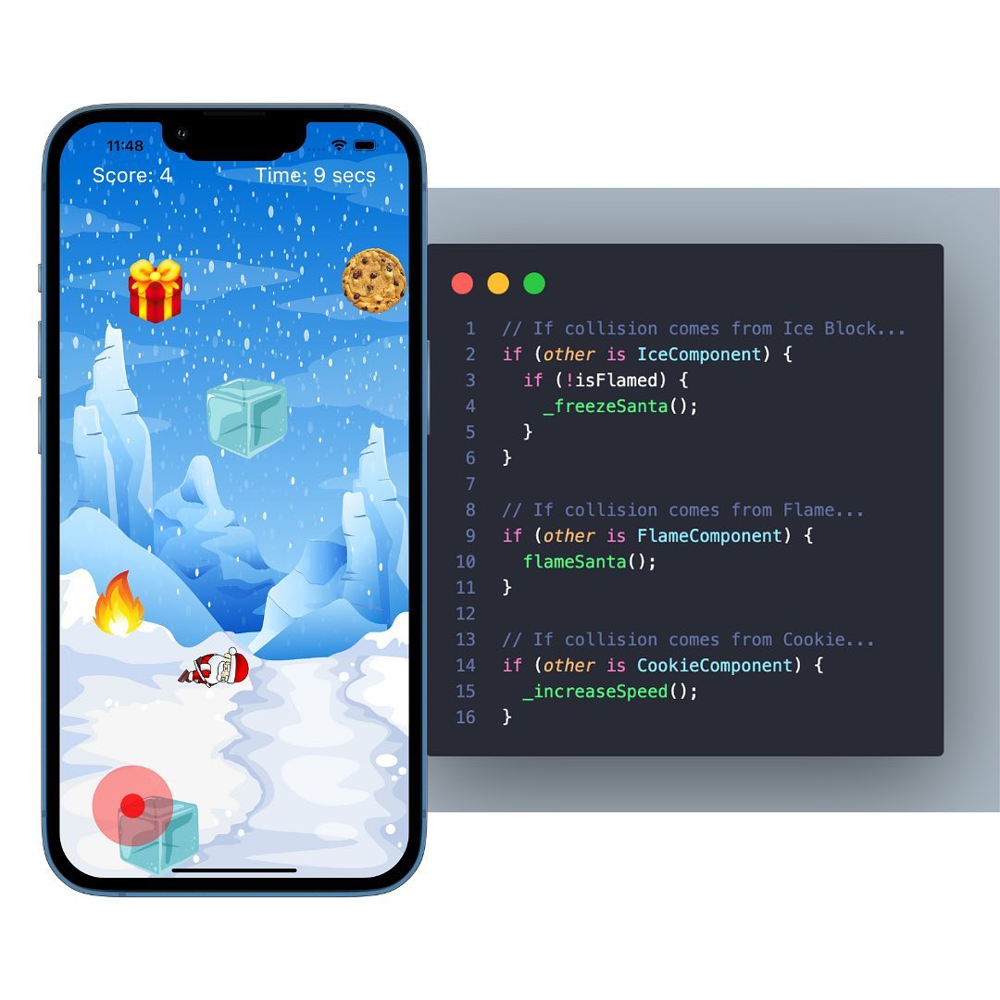
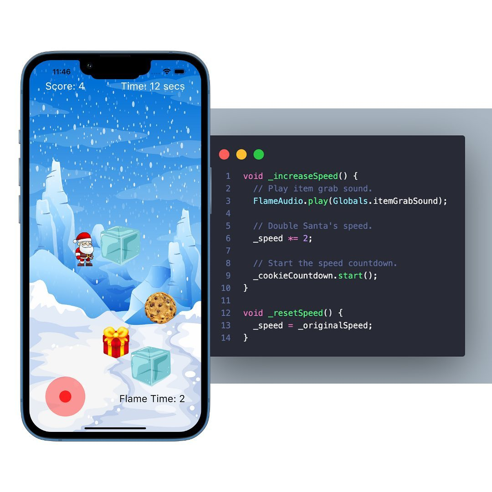
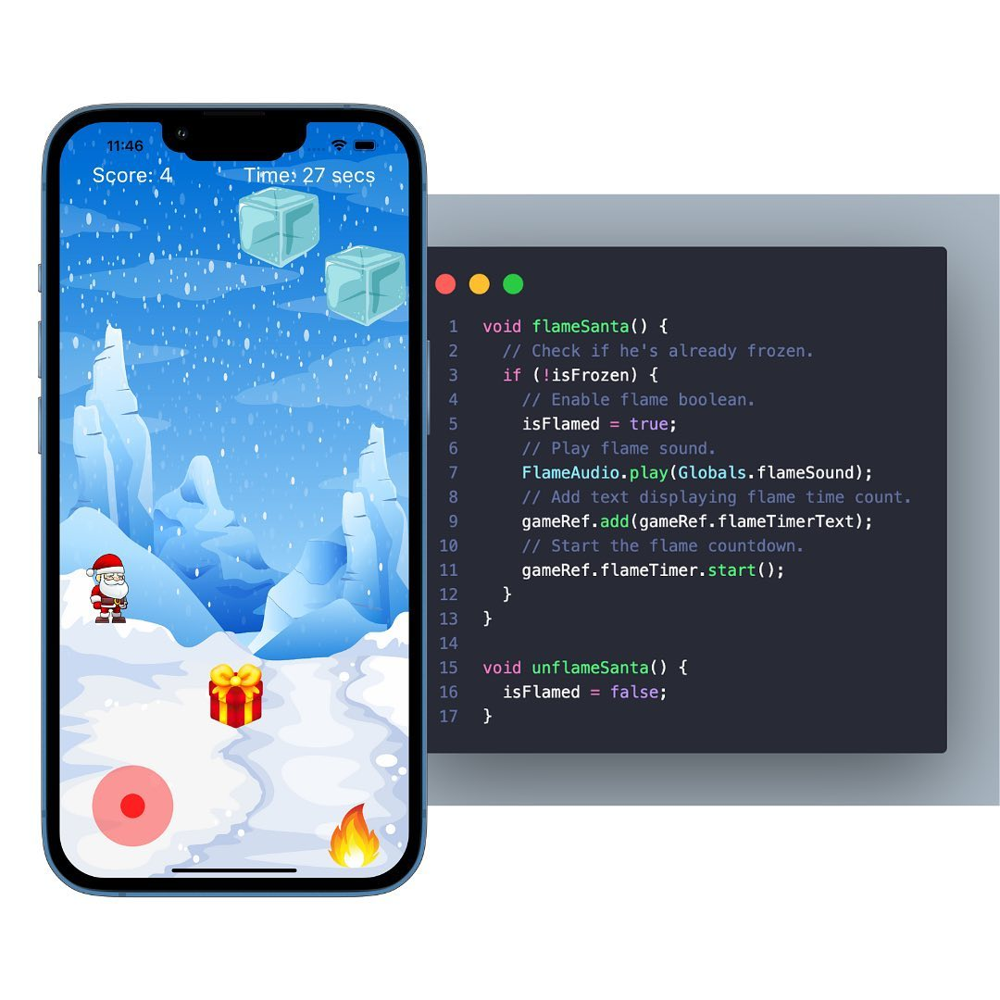

 
> Havana Cappuccino from [Wholly Grounds](https://whollygrounds.com/) in Dayton, Ohio
> 

I added a few power-ups to the Gift Grab game to make the game more interesting.

Originally, the game was based on Santa collecting as many gifts as he could within 30 seconds while dodging the ice blocks, (which would freeze him).

After the app got rejecting on the App Store for not being challenging enough, a few of you recommended I add a few new features.

One, the flame power-up, allows Santa to be immune to the ice blocks for 10 seconds.

Two, the cookie power-up, doubles Santa’s speed on the map for 10 seconds as well.

I also increased the game time to 45 seconds.

Of course, I’ll still need to add multiple levels, high scores, and difficulty adjustments, but this was a good start.

<video width="100%" height="auto" controls key="gift-grab-video">
  <source src="./gift-grab.mp4" type="video/mp4">
  Your browser does not support the video tag.
</video>