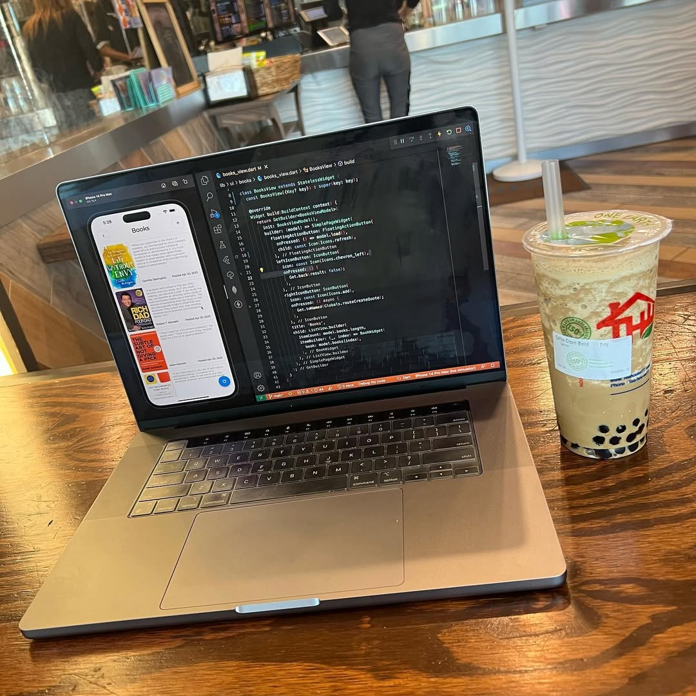
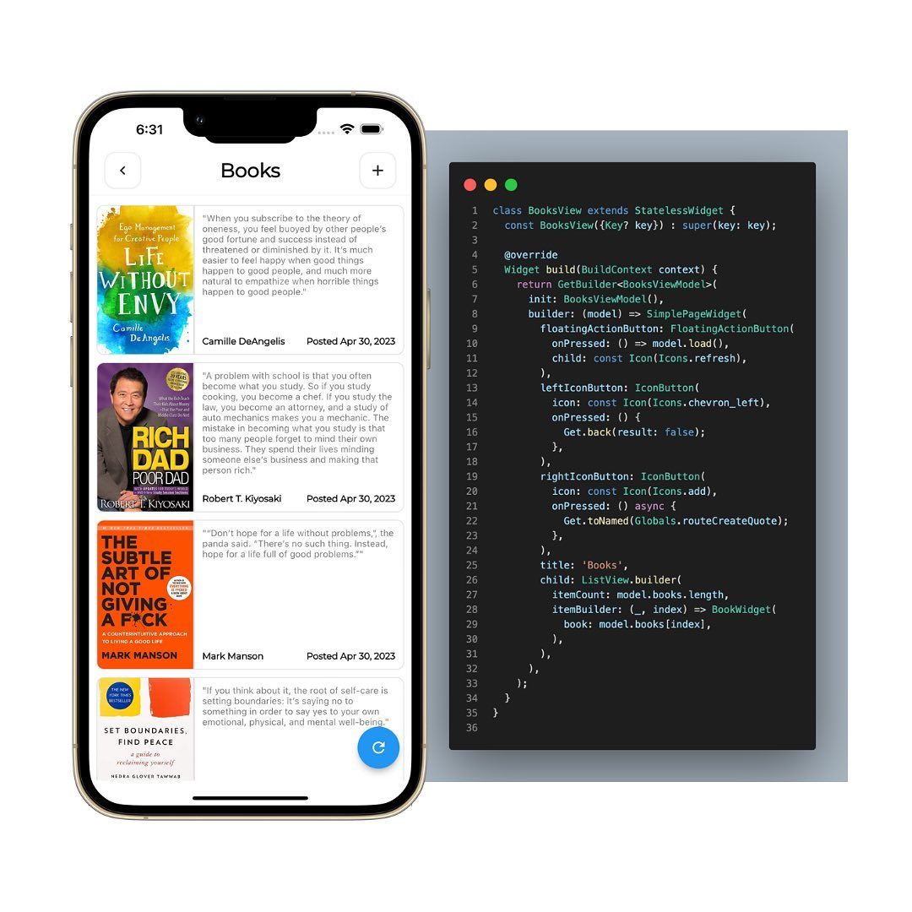
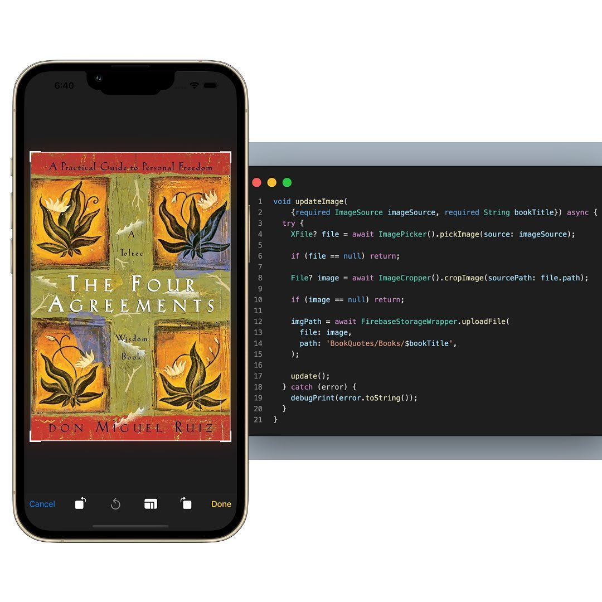
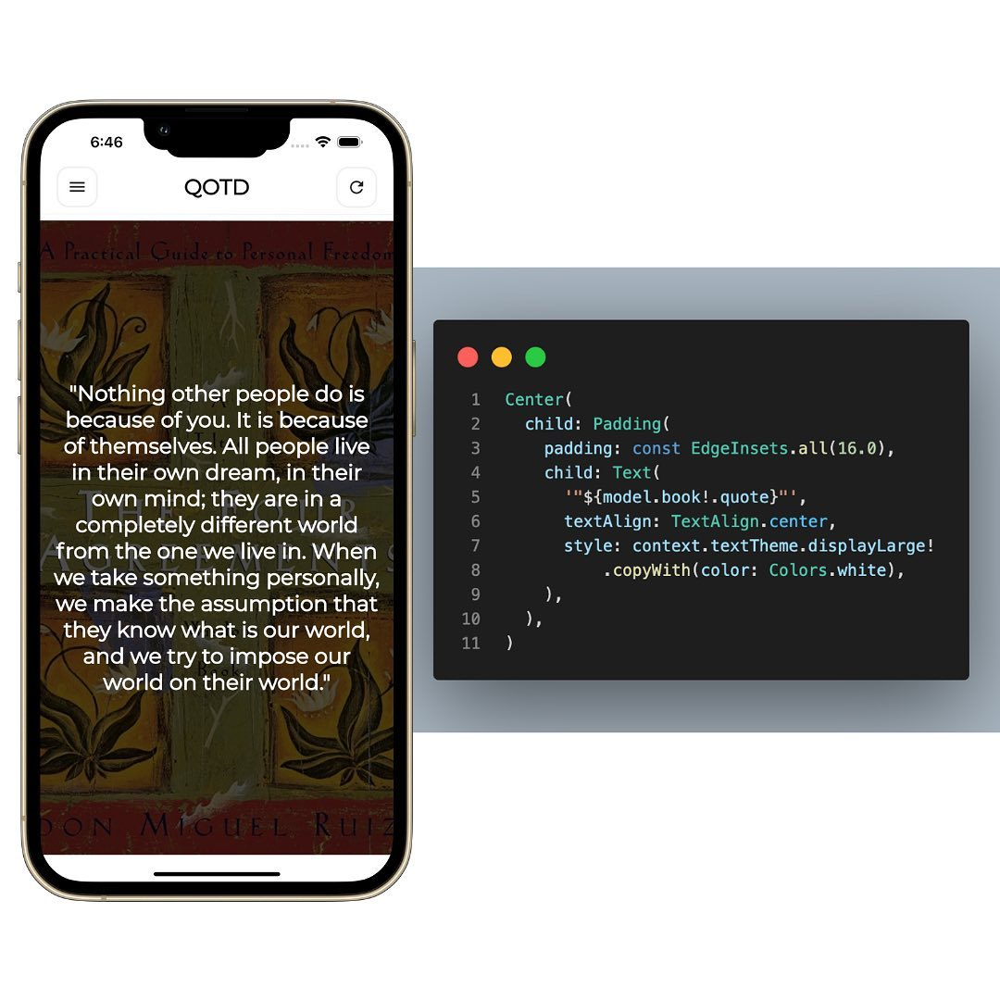

 
> Coffee Cream Blend Boba Tea from [Teahouse Tapioca & Tea](https://teahousebeverage.com/) in Houston, Texas
> 

I started a simple side project the other day.

While reading books, I like to take notes of some of my favorite quotes throughout the reading.

Typically to view my favorite quote, I would need to open up the book again and look for my highlighted text.

However, I thought the process could be easier if a Flutter app could be used to store all the books I’ve read as well as the best quote.

In the app, I upload meta data related to the book, then on the dashboard, my favorite quotes are randomly displayed.

Making apps that are truly effective in everyday life is the mantra.
 
<video width="100%" height="auto" controls key="flutter-book-quotes-video">
   <source src="./AQP9PYZc8TMRiW7cOYmVgJOjG0m6HKt5EUjsfws3rcOOhB9u1i7J0kqH8V9Cwofpn6ZfGFA15v673ek2JSvZz9B.mp4" type="video/mp4">
   Your browser does not support the video tag.
</video>