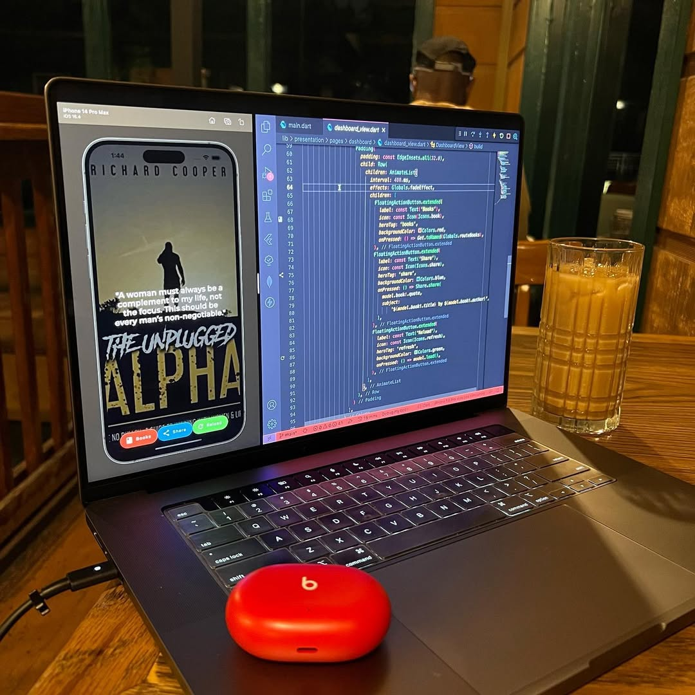
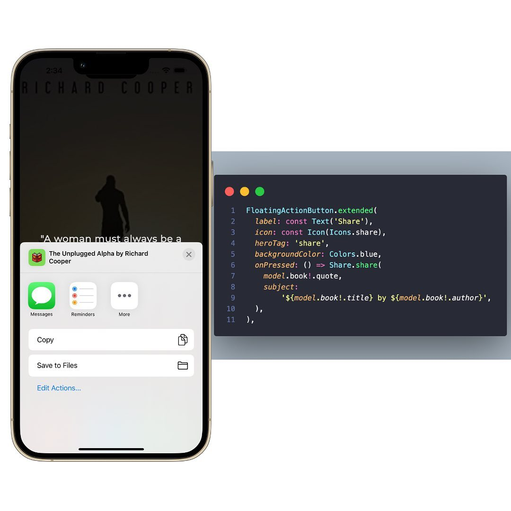
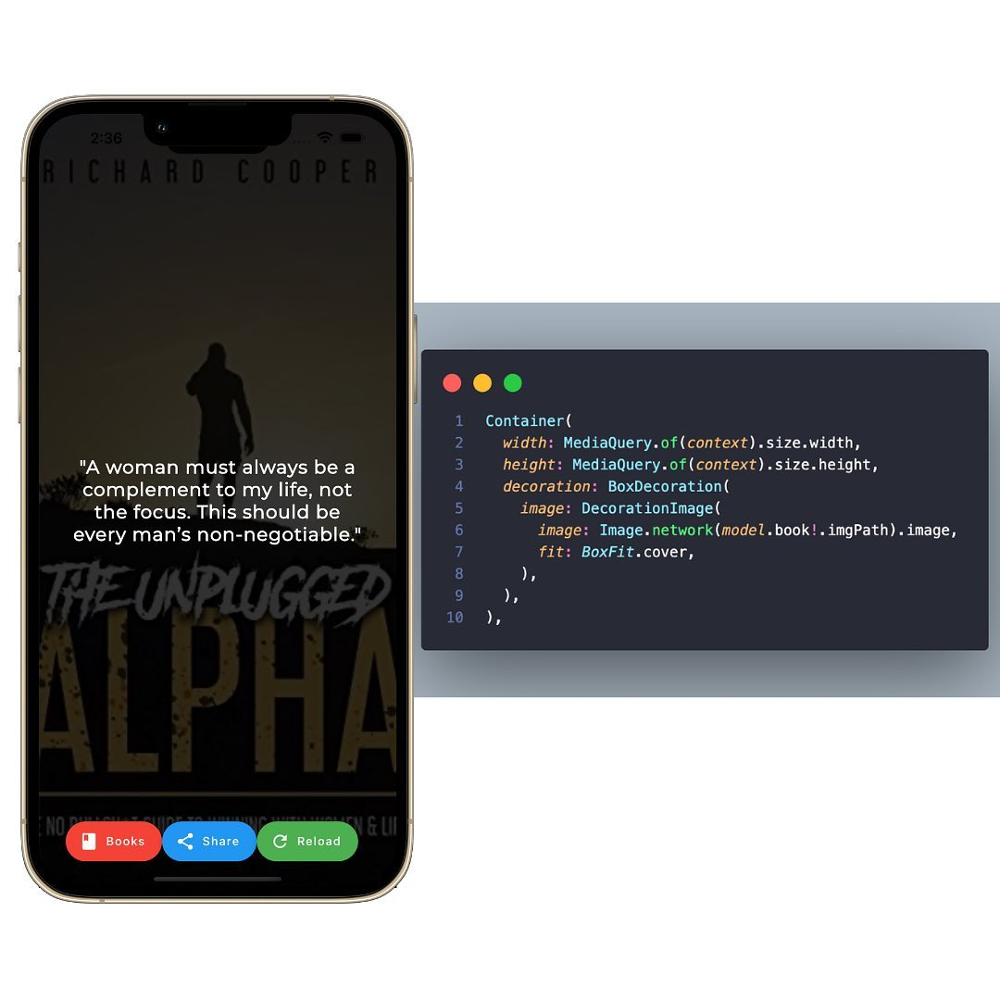
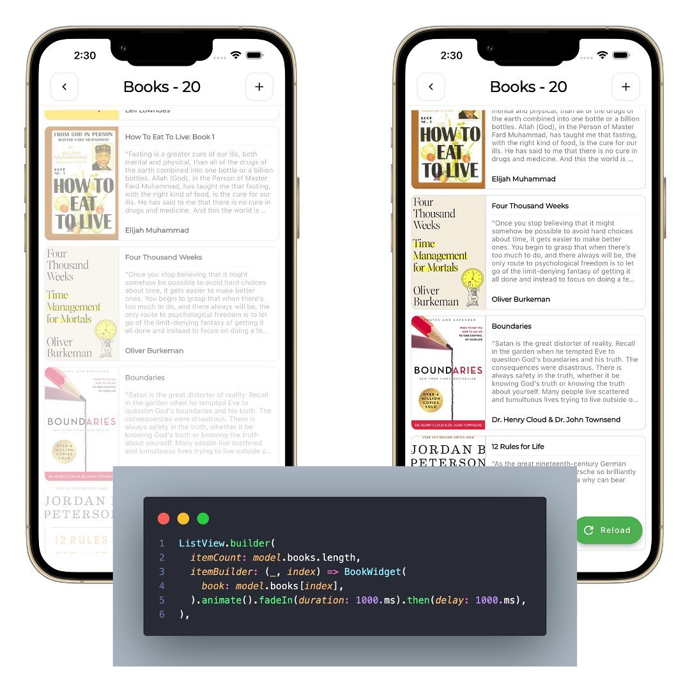

 
> Cold Brew from [Agora](https://www.agorahouston.com/) in Houston, Texas
> 

Made a few additions on the Book Quote app.

Mainly UI based, but also a social improvement as well.

1. A new “share” feature. Using the share flutter package, I can easily share book quotes via text, email, social platforms, and more.

2. Added animations to widgets. Using the flutter_animate flutter package, widgets can now be rendered with effects such as fade in, bounce in, slide in, etc, while also being able to specify the duration of said effects.

3. Made the book cover full screen. The previous update had the app bar showing, which looked slightly tacky and took away from the actual books presentation, so now it overlays the entire screen.

<video width="100%" height="auto" controls key="book-quotes-video">
   <source src="./AQN5v4XtF_nui5AXv6wl9FEmMNdBsquL9Vzs2ONuda7xRyxWbGK65yWhfN_DLf0nHJNrmBL6Z0mri_9nYFnndlnZ.mp4" type="video/mp4">
   Your browser does not support the video tag.
</video>
