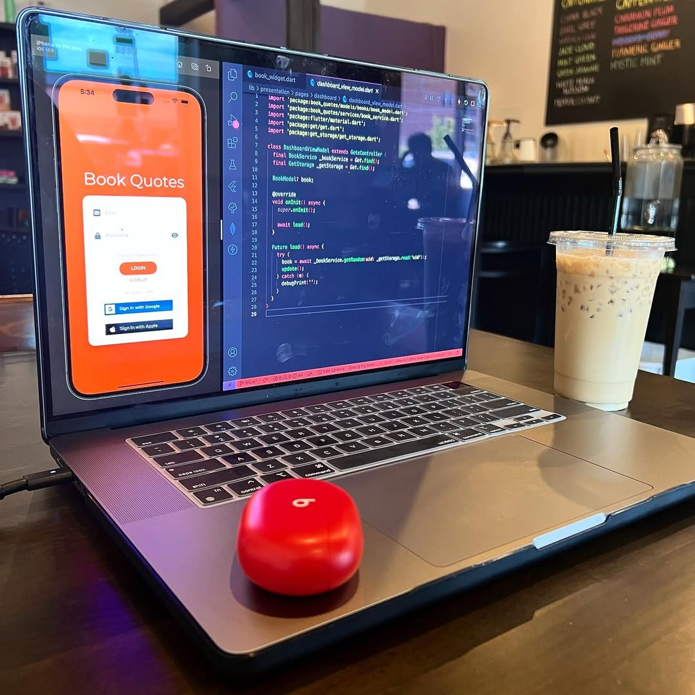
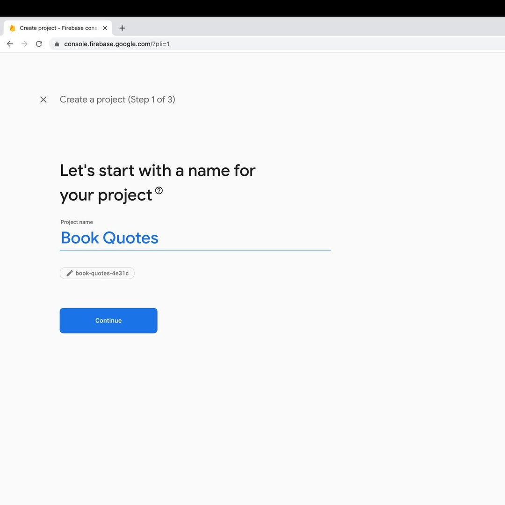
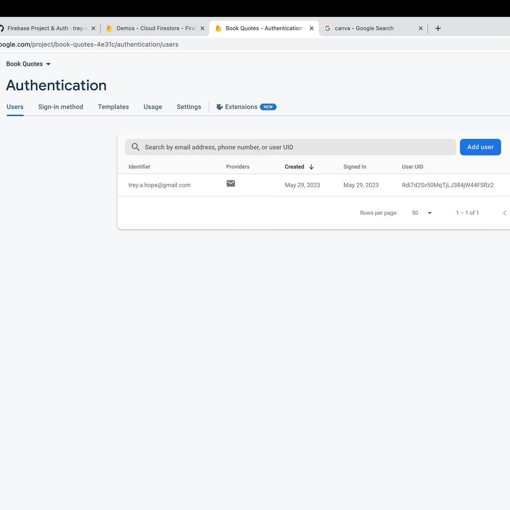
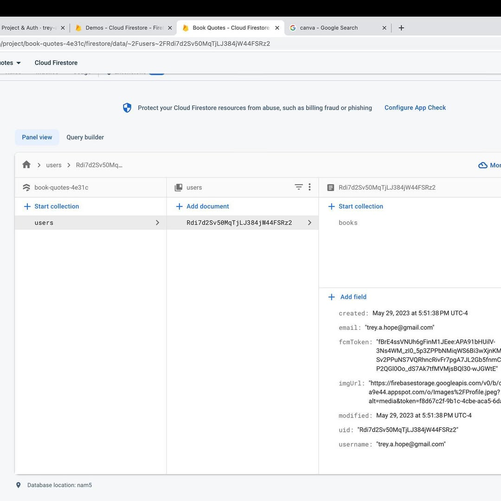

 
> Cold Brew from [Grand View Grind](https://www.instagram.com/grandviewgrind/) in Columbus, Ohio
> 

The Book Quote app needed to have its own Firebase project, as I was previously using it under another one.

To do this, I had to also start moving the data in Cloud Firestore and Firebase Storage to the new Firebase project.

A very tedious task that I’ll eventually get to over time.

But for now, the app also now supports authentication.

I plan to release it to the public so that others can upload their very own favorite book quotes as well.

I needed to restructure the database to have a users collection, which each document in the collection will contain both

1. User related meta data.
2. A books collection that stores their favorite books and their quotes.

<video width="100%" height="auto" controls key="book-quotes-video">
   <source src="./AQPTJNx71J8GFWfPFAn1KLXxmZ8u5Q1RNwqiHqDkR8TuDCKXau9gsphLbDvtKjG9qhBKFYaHKqnygbpdV2LVYISu.mp4" type="video/mp4">
   Your browser does not support the video tag.
</video>
