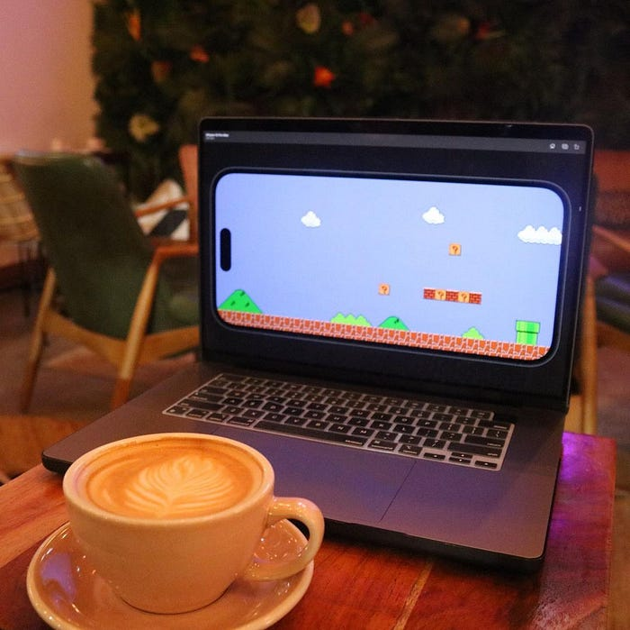
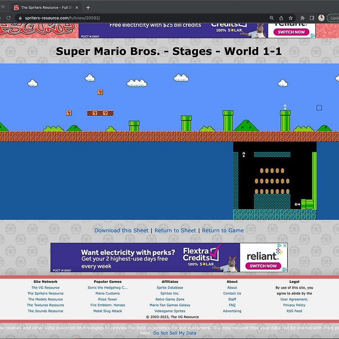
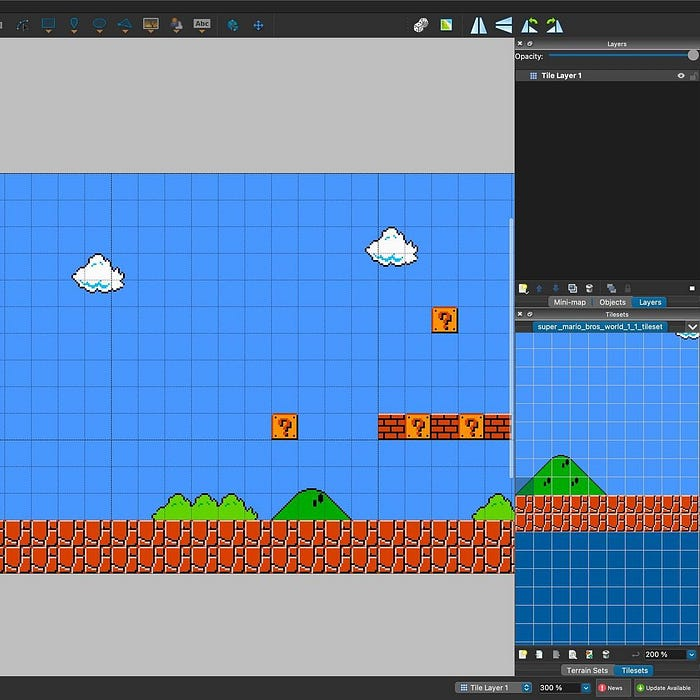
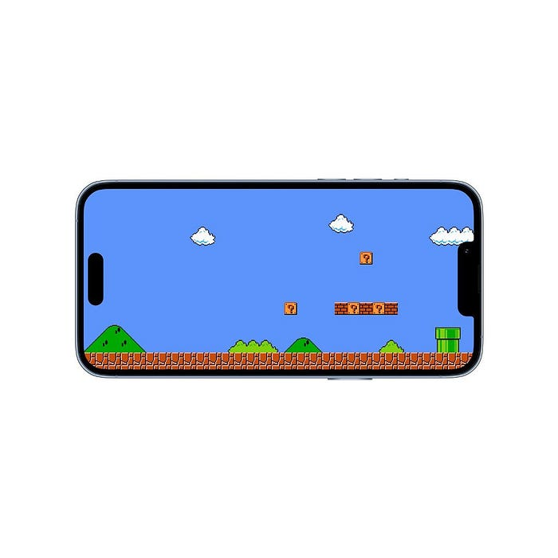

> THC Infused Turkish Delight from [Wild Concepts](https://www.wildconcepts.com/home/heights) in Houston, Texas
> 

Most likely to be the most challenging game I've worked on, because of how many pieces are needed to make this game in Flutter.

<br/>*Super Mario Bros. assests*

For now, I have the background which I was able to use from someone's picture of world one, level one in the game.

<br/>*Tiled.io editor for creating maps*

```dart
class Globals {
  Globals._();

  /// Levels
  static const lv_1_1 = 'world_1_1_map.tmx';
}

import 'package: flame/components.dart'; 
import 'package: flame_tiled/flame_tiled.dart';
import 'package: mario/constants/globals.dart';

enum Level {
  level_1_1(path: Globals. level_1_1); 

  const Level({required this.path}); 
  
  final String path; 
}

class Levels extends Component {
  final Level level;

  Levels({required this. level}): super();

  @override
  Future<void>? onLoad() async {
    final TiledComponent map = await TiledComponent.load(
      level.path,
      Vector2.all(30),
    );

    add(map);

    return super.onLoad();
  }
}
```

I then built a map from using the tiles produced from the image, (checkout [Tiled.io](https://www.mapeditor.org/) for creating maps in your game).

```dart
import 'package: flame/game.dart';
import 'package:mario/constants/levels.dart';

class SuperMario BrosGame extends FlameGame {
  @override
  Future<void onLoad() async {
    add (Levels (level: Level. level_1_1));

    return super.onLoad();
  }
}
```

Next step is to split the level into layers so that Mario can actually walk through the map.

<br/>*Game running on an iPhone in landscape mode.*