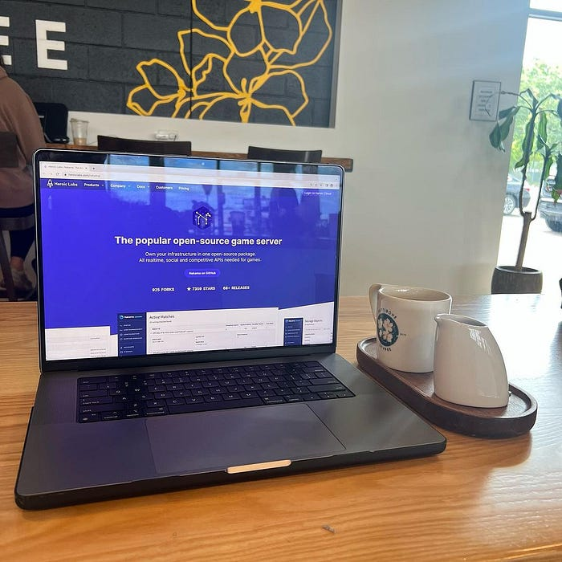
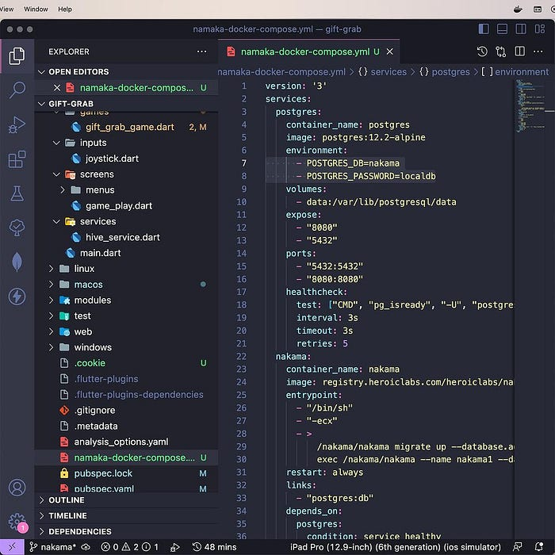
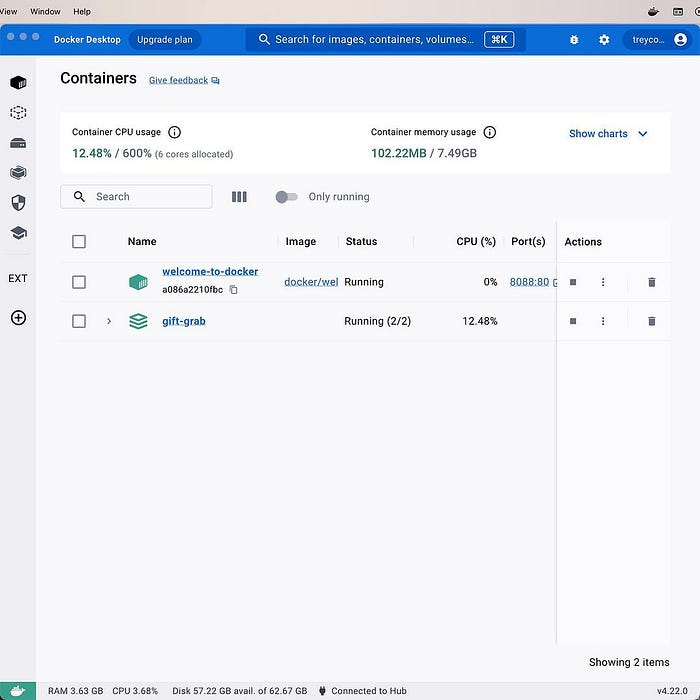
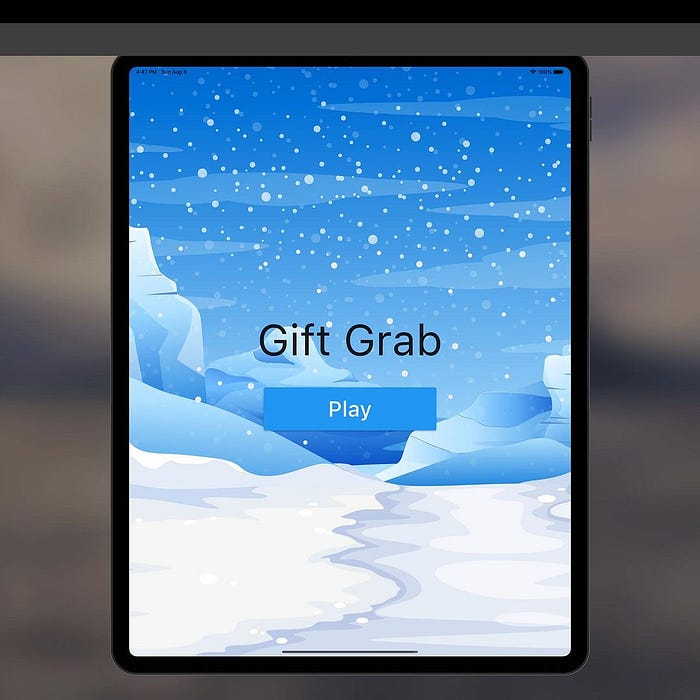
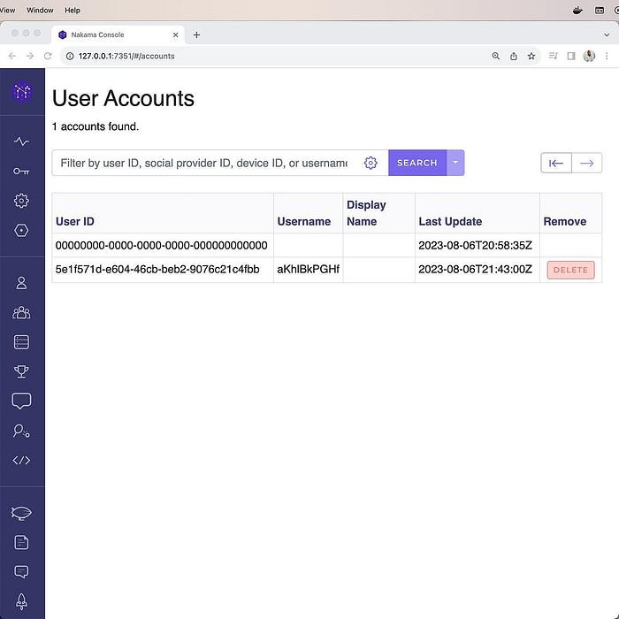

> Columbia Peach Coffee from [**Pettibone Coffee**](https://pettibonecoffee.com/) in Dayton, OH.
> 

Have you ever wanted to build a game in your favorite development framework? Maybe a 2D side scroller like Donkey Kong Country? Or an RPG type game similar to Pokemon?

<br/>*Nakama-docker-compose.yml, the configuration file for building the container.*

Building these games on the front end might not pose much of a challenge with frameworks like Flame and Bonfire available, but what about the backend? How would you manage the data for building and scaling your game?

```bash
# Command for building container.
docker-compose -f nakama docker-compose.yml up
```

This is where **[Nakama](https://heroiclabs.com/nakama/)** comes in. This robust platform paves the way for game developers to build engaging online multiplayer games across a wide range of game development engines.

<br/>*The Gift-Grab container.*

Notably, Nakama supports a diverse array of engines including, but not limited to, Godot, Unity, Unreal Engine, MonoGame, LibGDX, Defold, Cocos2d, Phaser, and Macroquad.

<br/>*Gift-Grab game running on iPad.*

I figured this could be useful when creating my own games in the near future.

```dart
/// Create client.
final client = getNakamaClient( 
  host: '127.0.0.1',
  ssl: false,
  serverKey: 'defaultkey',
);

/// Sign in via email/password.
final session = await client.authenticateEmail(
  email: 'trey.a.hope@gmail.com',
  password: '123password',
)

debug Print (session.userId);
// flutter: 5e1f571d-e604-46cb-beb2-9076c21c4fbb
```

For now, the Gift-Grab game is going to be the test dummy for this new application, so I'll be seeing if I can setup some online capabilities for it.

<br/>*New user ready for online gaming.*

To install Nakama, I'm using Docker to build the **container** where the project will live.