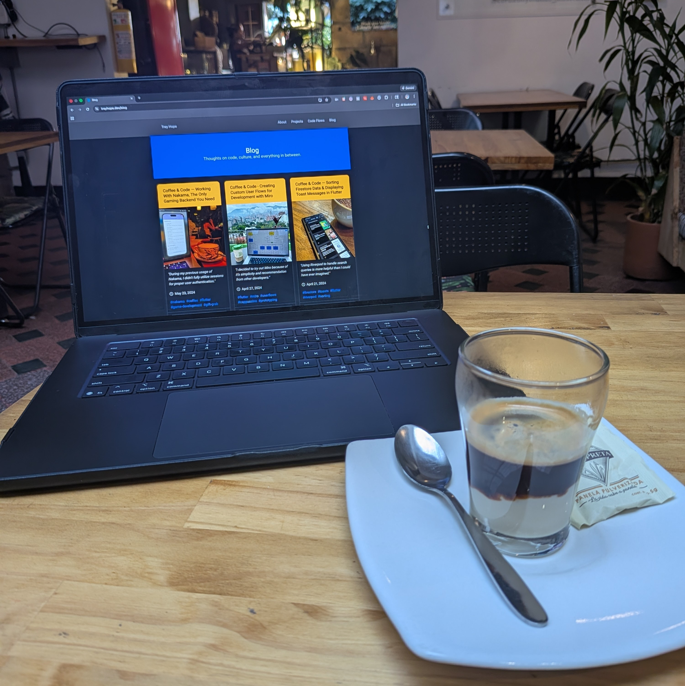

> Café Bombón from [Naturalia Café](https://naturaliacafe-fkc32fw.gamma.site/) in Laureles, Medellín
> 

I still remember the first web project I made in college: a website about my favorite X-Men character, Wolverine.

The site was quite basic and rough around the edges, but I loved being able to create something for the web that was flexible and expressed my ideas.

However, I found the actual development process—working directly with **HTML** and **CSS**—to be somewhat cumbersome.

I haven't dabbled much in web development since mobile development—especially Flutter—sparked my interest.


> Jaspr website.
> 

Luckily, that's where the beauty of [Jaspr](https://jaspr.site/) comes in; it addresses some of the challenges with web development and offers a better experience for developers.

It's built using **Dart** and has a very similar feel to [Flutter](https://flutter.dev/), even though it targets an entirely different platform.

In fact, you don't use any Flutter in a Jaspr app at all (unless you plan to embed some widgets).

In Jaspr, the concept of **Components** is inspired by the concept of **Widgets** in Flutter.

```dart
// A stateless component that renders a Bulma CSS hero section
class BulmaHero extends StatelessComponent {
  final String title;
  final String subtitle;

  const BulmaHero({
    required this.title,
    required this.subtitle,
    super.key,
  });

  @override
  Component build(BuildContext context) {
    // Create a small, centered container with Bulma's hero styling
    return section(
      id: 'bulma-hero',
      classes: 'container is-small is-max-desktop section hero is-link',
      [
        // Center-aligned hero content
        div(classes: 'hero-body has-text-centered', [
          // Main title
          p(classes: 'title', [
            .text(title),
          ]),
          // Subtitle text
          p(classes: 'subtitle', [
            .text(subtitle),
          ]),
        ]),
      ],
    );
  }
}
```

Over the Christmas break, I've been using Jaspr to rebuild my original website (which was built using [Flutter Web](https://flutter.dev/multi-platform/web)) to feel like a true website rather than a web app.

The cool part is it looks like a normal widget, but it actually gets compiled into valid HTML and CSS for the web.


> The **BulmaHero** component as valid HTML.
> 

Since it's a web framework, it uses CSS, which means I can easily integrate a CSS framework like [Bulma](https://bulma.io/) and build my own components from there.


> Bulma site.
> 

Jaspr offers several advantages that I've noticed:

- *Improved SEO (search engines can better index the content)*
- *Better routing architecture (supports both single-page and multi-page routing using a server/client approach)*
- *Faster load times (the app is significantly lighter than a typical Flutter web app)*

If you're looking to learn a new framework, enjoy web development but prefer alternatives to conventional methods, or simply have been exposed to Flutter in some way, I highly recommend checking it out.

Major kudos to the creators of both projects: [Kilian Schulte](https://x.com/schultek_dev) for Jaspr and [Jeremy Thomas](https://x.com/jgthms) for Bulma. Stay tuned for further progress.